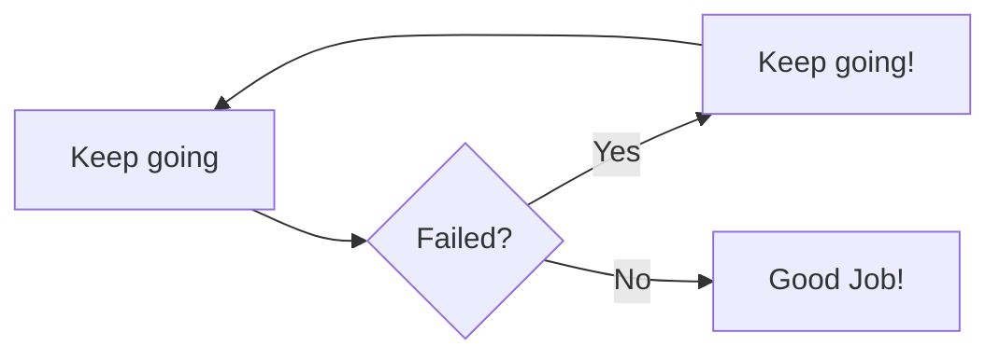

## Diagrams

Mermaid diagram:

<!-- In order to use it you should 
enable diagram support 
settings -- language -- markdown -- 
enable either  Mermaid or PlantUML --
click apply and ok -->

```mermaid
graph LR;
    A[Keep going] --> B{Failed?}
    B -- Yes --> C[Keep going!]
    B -- No --> E[Good Job!]
    C --> A
```